# Yachiyo 项目结构

```mermaid
graph TD
    ROOT[yachiyo/] --> APP[app/]
    ROOT --> COMP[components/]
    ROOT --> HOOKS[hooks/]
    ROOT --> LIB[lib/]
    ROOT --> TYPES[types/]
    ROOT --> MOCK[mock/]
    ROOT --> DOCS[docks/]
    ROOT --> PUB[public/]
    ROOT --> CFG[配置文件]

    APP --> LAYOUT[layout.tsx<br/>根布局·Geist 字体注入]
    APP --> GLOBAL[globals.css<br/>Tailwind 全局样式]
    APP --> PAGE[page.tsx<br/>首页]
    APP --> ERROR[error.tsx<br/>全局错误边界]
    APP --> NF[not-found.tsx<br/>404 页面]
    APP --> LOGIN[login/]
    APP --> DASH[dashboard/]
    APP --> FORBID[forbidden/<br/>403 占位]
    APP --> API[api/]

    LOGIN --> LPAGE[page.tsx<br/>登录页·表单切换]
    LOGIN --> LCSS[page.module.css<br/>拟态风格样式]
    LOGIN --> LCOMP[components/]
    LCOMP --> LOGINC[Login.tsx<br/>登录表单·react-hook-form + zod]
    LCOMP --> REGC[Register.tsx<br/>注册表单·react-hook-form + zod]
    LCOMP --> SWC[SwitchBox.tsx<br/>切换面板·视差动画]

    DASH --> DLAY[dashboard/layout.tsx<br/>仪表盘布局]
    DASH --> DDOC[dashboard/documents/<br/>文档模块占位]
    DASH --> DQA[dashboard/qa/<br/>问答模块占位]

    API --> AUTH[api/auth/]
    AUTH --> LOGINAPI[login/route.ts<br/>POST 登录·JWT 签发]
    AUTH --> REGAPI[register/register.ts<br/>POST 注册占位]

    COMP --> BTN[Button.tsx<br/>拟态按钮·disabled/loading]

    HOOKS --> MOUSE[useMouseFollower.tsx<br/>鼠标跟随视差 Hook]

    MOCK --> DB[db.json<br/>json-server 用户数据]

    DOCS --> DPROJ[project/]
    DPROJ --> STRUCT[结构文档.md]
    DPROJ --> LOG[开发日志.md]

    DOCS --> DDASH[dashboard/]
    DOCS --> DLOGIN[login/]

    PUB --> IMG[kaguya.jpg / yiruha.jpg<br/>yachiyo.jpg / prts.jpg / raze.jpg]

    CFG --> MW[middleware.ts<br/>中间件·空]
    CFG --> NXTC[next.config.ts]
    CFG --> TSC[tsconfig.json]
    CFG --> PKG[package.json]
    CFG --> POST[postcss.config.mjs]
    CFG --> ESLINT[eslint.config.mjs]
    CFG --> AGENTS[AGENTS.md]
    CFG --> CLAUDE[CLAUDE.md]
```

## 技术栈

| 类别 | 技术 |
|------|------|
| 框架 | Next.js 16 (App Router) |
| UI 库 | React 19 |
| 样式 | Tailwind CSS 4 + CSS Modules |
| 表单 | react-hook-form + zod |
| Mock | json-server (db.json) |
| 认证 | JWT (jsonwebtoken) |
| 包管理 | pnpm |

## 关键依赖

- `react-hook-form` — 表单状态管理与验证
- `@hookform/resolvers` + `zod` — 表单 schema 校验
- `jsonwebtoken` — JWT token 签发与验证
- `antd` — Ant Design 组件库（message 等）
- `next` 16.2.4 — React 全栈框架
